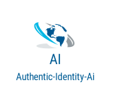

# PersonAuthentication-ios-SDK
iOS Framework for capturing documents of a person to authenticate his identity and faces at a resolution appropriate for our proprietary Deep Learning Face Recognition Engines using Artificial Intelligence.

